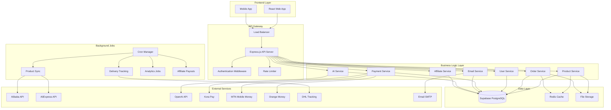
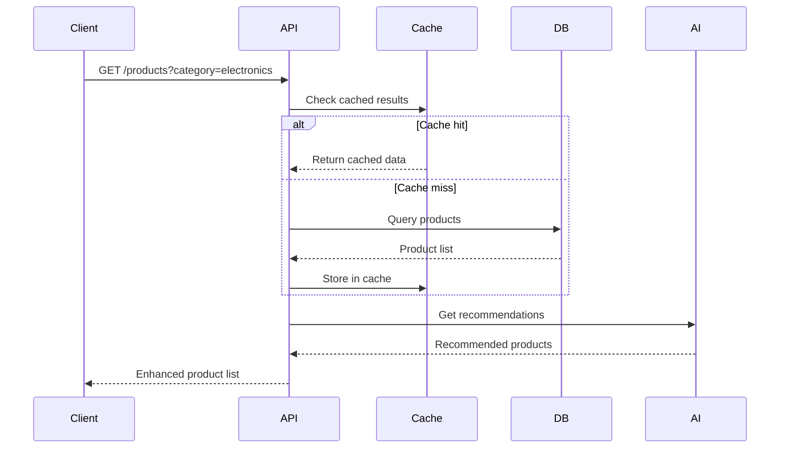
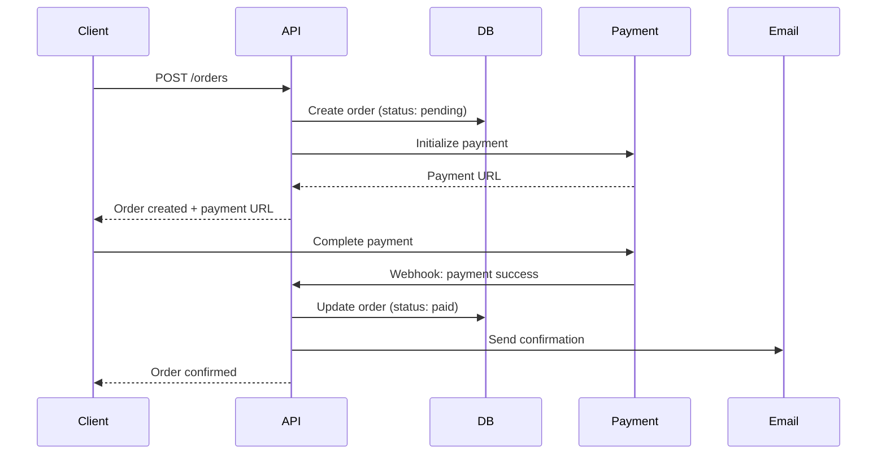
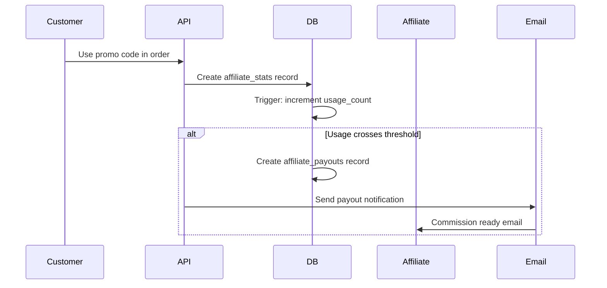

# Mallgram Backend Architecture Documentation

## Table of Contents
1. [System Overview](#system-overview)
2. [Architecture Diagram](#architecture-diagram)
3. [Technology Stack](#technology-stack)
4. [Core Components](#core-components)
5. [API Flow](#api-flow)
6. [Database Design](#database-design)
7. [External Integrations](#external-integrations)
8. [Security Architecture](#security-architecture)
9. [Deployment Architecture](#deployment-architecture)
10. [Performance & Scalability](#performance--scalability)

## System Overview

Mallgram is a pan-African e-commerce platform that connects African consumers with Chinese suppliers through Alibaba and AliExpress. The backend is built with Node.js and Express.js, providing a robust REST API that supports:

- **Multi-country Operations**: Starting with South Africa and Cameroon
- **B2B and B2C Sales**: Separate product tables for retail and wholesale
- **AI-Powered Shopping**: OpenAI integration for product recommendations
- **Affiliate Marketing**: Commission-based referral system
- **Multi-language Support**: English and French
- **Local Payment Methods**: Integration with African payment gateways

## Architecture Diagram



## Technology Stack

### Backend Framework
- **Node.js 18+**: JavaScript runtime
- **Express.js 4.18+**: Web application framework
- **ES6+ JavaScript**: Modern JavaScript features

### Database & Storage
- **Supabase**: PostgreSQL database with real-time capabilities
- **PostgreSQL 15**: Primary database
- **File Storage**: Supabase Storage for images and documents

### Authentication & Security
- **Supabase Auth**: User authentication and session management
- **JWT**: Token-based authentication
- **bcryptjs**: Password hashing
- **Helmet**: Security headers
- **CORS**: Cross-origin resource sharing

### External APIs
- **Alibaba API**: B2B product sourcing
- **AliExpress API**: B2C product sourcing
- **OpenAI API**: AI chatbot and recommendations
- **Payment Gateways**: Kora Pay, MTN, Orange Money, PayGate, PayFast

### Background Processing
- **node-cron**: Scheduled task management
- **Axios**: HTTP client for external APIs
- **Nodemailer**: Email sending

### Monitoring & Logging
- **Winston**: Comprehensive logging
- **Daily Rotate File**: Log rotation
- **Custom Middleware**: Request/response logging

## Core Components

### 1. Authentication System
```javascript
// JWT-based authentication with Supabase integration
const authMiddleware = async (req, res, next) => {
    // Verify JWT token
    // Fetch user from database
    // Attach user to request object
    // Handle role-based authorization
};
```

**Features:**
- JWT token generation and validation
- Role-based access control (Admin, Affiliate, User)
- Session management with Supabase Auth
- Password reset and email verification

### 2. Product Management System
```javascript
// Dual product tables for B2B and B2C
const products = {
    b2c: 'products',          // Minimum order quantity < 2
    b2b: 'products_retailer'  // Minimum order quantity >= 2
};
```

**Features:**
- Automated product synchronization from Alibaba/AliExpress
- Quality filtering based on seller ratings and reviews
- Category management with hierarchical structure
- Inventory tracking and stock management
- Image and media management

### 3. Order Processing System
```javascript
// Complete order lifecycle management
const orderStates = [
    'pending',     // Order created, payment pending
    'paid',        // Payment confirmed
    'shipped',     // Order dispatched
    'delivered',   // Order completed
    'cancelled'    // Order cancelled
];
```

**Features:**
- Shopping cart management
- Order creation and processing
- Payment integration with multiple gateways
- Shipping and tracking integration
- Order history and status updates

### 4. Affiliate Marketing System
```javascript
// Commission-based referral system
const affiliateFlow = {
    registration: 'Apply for affiliate status',
    approval: 'Admin approves application',
    codeGeneration: 'Generate unique promo codes',
    tracking: 'Track usage and commissions',
    payout: 'Automated commission payments'
};
```

**Features:**
- Affiliate registration and approval
- Promo code generation and management
- Usage tracking and analytics
- Automated commission calculations
- Payout processing and notifications

### 5. AI Integration System
```javascript
// OpenAI-powered features
const aiFeatures = {
    chatbot: 'Customer support and product recommendations',
    search: 'Intelligent product search',
    analytics: 'Business intelligence and insights'
};
```

**Features:**
- Natural language product search
- Personalized recommendations
- Customer support chatbot
- Analytics and business insights

## API Flow

### 1. Product Discovery Flow


### 2. Order Processing Flow


### 3. Affiliate Commission Flow


## Database Design

### Core Tables Structure

#### Users & Authentication
```sql
users (
    id UUID PRIMARY KEY,
    email TEXT UNIQUE,
    full_name TEXT,
    is_admin BOOLEAN DEFAULT FALSE,
    is_affiliate BOOLEAN DEFAULT FALSE,
    created_at TIMESTAMPTZ,
    updated_at TIMESTAMPTZ
)
```

#### Product Management
```sql
-- B2C Products (quantity < 2)
products (
    id UUID PRIMARY KEY,
    external_id TEXT,
    name TEXT NOT NULL,
    category_id UUID REFERENCES categories(id),
    price_mallgram NUMERIC(12,2),
    is_retailer BOOLEAN DEFAULT FALSE,
    seller_rating NUMERIC(3,2),
    review_count INT,
    created_at TIMESTAMPTZ,
    updated_at TIMESTAMPTZ
)

-- B2B Products (quantity >= 2)
products_retailer (
    id UUID PRIMARY KEY,
    external_id TEXT,
    name TEXT NOT NULL,
    category_id UUID REFERENCES categories(id),
    price_mallgram NUMERIC(12,2),
    min_order_quantity INT DEFAULT 2,
    bulk_discount_percent NUMERIC(5,2),
    is_retailer BOOLEAN DEFAULT TRUE,
    created_at TIMESTAMPTZ,
    updated_at TIMESTAMPTZ
)
```

#### Order Management
```sql
orders (
    id UUID PRIMARY KEY,
    user_id UUID REFERENCES users(id),
    status order_status DEFAULT 'pending',
    payment_status payment_status DEFAULT 'pending',
    total_price NUMERIC(12,2),
    tracking_number TEXT,
    created_at TIMESTAMPTZ,
    updated_at TIMESTAMPTZ
)

order_items (
    id UUID PRIMARY KEY,
    order_id UUID REFERENCES orders(id),
    product_id UUID REFERENCES products(id),
    quantity INT,
    unit_price NUMERIC(12,2),
    subtotal NUMERIC(12,2) GENERATED ALWAYS AS (quantity * unit_price) STORED
)
```

#### Affiliate System
```sql
affiliates (
    id UUID PRIMARY KEY,
    user_id UUID REFERENCES users(id),
    default_commission_amount NUMERIC(12,2) DEFAULT 15000,
    threshold_uses INT DEFAULT 100
)

promo_codes (
    id UUID PRIMARY KEY,
    code TEXT UNIQUE,
    affiliate_id UUID REFERENCES affiliates(id),
    admin_id UUID REFERENCES admins(id),
    usage_count INT DEFAULT 0,
    usage_limit INT DEFAULT 100,
    status TEXT DEFAULT 'active',
    CHECK ((affiliate_id IS NOT NULL AND admin_id IS NULL) OR 
           (affiliate_id IS NULL AND admin_id IS NOT NULL))
)

affiliate_payouts (
    id UUID PRIMARY KEY,
    affiliate_id UUID REFERENCES affiliates(id),
    promo_code_id UUID REFERENCES promo_codes(id),
    block_number INT,
    payout_amount NUMERIC(12,2),
    payout_status TEXT DEFAULT 'pending',
    UNIQUE(promo_code_id, block_number)
)
```

### Database Triggers

#### Automatic Timestamp Updates
```sql
CREATE OR REPLACE FUNCTION update_updated_at_column()
RETURNS TRIGGER AS $$
BEGIN
    NEW.updated_at = now();
    RETURN NEW;
END;
$$ language 'plpgsql';
```

#### Affiliate Commission Processing
```sql
CREATE OR REPLACE FUNCTION fn_after_affiliate_stat_insert()
RETURNS TRIGGER AS $$
BEGIN
    -- Increment promo code usage
    -- Check if threshold crossed
    -- Create payout record if applicable
    -- Handle admin vs affiliate logic
    RETURN NEW;
END;
$$ LANGUAGE plpgsql;
```

## External Integrations

### 1. E-commerce APIs

#### Alibaba API Integration
```javascript
class AlibabaClient {
    constructor() {
        this.baseURL = process.env.ALIBABA_BASE_URL;
        this.apiKey = process.env.ALIBABA_API_KEY;
        this.apiSecret = process.env.ALIBABA_API_SECRET;
    }

    async searchProducts(query, options = {}) {
        // Implement Alibaba product search
        // Handle pagination and rate limiting
        // Transform data to our schema
        // Store in products_retailer table (B2B)
    }
}
```

#### AliExpress API Integration
```javascript
class AliExpressClient {
    constructor() {
        this.baseURL = process.env.ALIEXPRESS_BASE_URL;
        this.apiKey = process.env.ALIEXPRESS_API_KEY;
    }

    async searchProducts(query, options = {}) {
        // Implement AliExpress product search
        // Store in products table (B2C)
    }
}
```

### 2. Payment Gateway Integrations

#### Multi-Gateway Payment System
```javascript
class PaymentService {
    constructor() {
        this.gateways = {
            'kora': new KoraPayGateway(),
            'mtn': new MTNGateway(),
            'orange': new OrangeMoneyGateway(),
            'paygate': new PayGateGateway(),
            'payfast': new PayFastGateway()
        };
    }

    async processPayment(orderData, paymentMethod, country) {
        const gateway = this.selectGateway(paymentMethod, country);
        return await gateway.processPayment(orderData);
    }

    selectGateway(method, country) {
        // Route to appropriate gateway based on method and country
        const routing = {
            'ZA': ['paygate', 'payfast', 'kora'],      // South Africa
            'CM': ['orange', 'mtn', 'kora'],           // Cameroon
        };
        return this.gateways[routing[country][0]];
    }
}
```

### 3. AI Integration

#### OpenAI Service
```javascript
class OpenAIService {
    constructor() {
        this.client = new OpenAI({
            apiKey: process.env.OPENAI_API_KEY
        });
    }

    async generateProductRecommendations(userQuery, userHistory) {
        const prompt = this.buildRecommendationPrompt(userQuery, userHistory);
        const response = await this.client.chat.completions.create({
            model: 'gpt-4',
            messages: [{ role: 'user', content: prompt }],
            max_tokens: 1000
        });
        return this.parseRecommendations(response);
    }

    async processChatQuery(query, context) {
        // Handle customer support queries
        // Search product database
        // Generate helpful responses
    }
}
```

### 4. Email Service Integration

#### Nodemailer Configuration
```javascript
class EmailService {
    constructor() {
        this.transporter = nodemailer.createTransporter({
            host: process.env.SMTP_HOST,
            port: 587,
            secure: false,
            auth: {
                user: process.env.SMTP_USER,
                pass: process.env.SMTP_PASSWORD
            }
        });
    }

    async sendTransactionalEmail(type, recipient, data) {
        const template = this.getTemplate(type);
        const html = this.renderTemplate(template, data);
        
        return await this.transporter.sendMail({
            from: process.env.FROM_EMAIL,
            to: recipient,
            subject: this.getSubject(type, data),
            html: html
        });
    }
}
```

## Security Architecture

### 1. Authentication & Authorization
- **JWT Tokens**: Stateless authentication with 7-day expiration
- **Role-Based Access Control**: Admin, Affiliate, and User roles
- **Password Security**: bcrypt hashing with salt rounds
- **Session Management**: Supabase Auth integration

### 2. API Security
- **Rate Limiting**: Configurable request limits per IP
- **CORS Configuration**: Restricted origin access
- **Helmet.js**: Security headers and CSP
- **Input Validation**: Comprehensive request validation

### 3. Data Protection
- **Sensitive Data Masking**: Automatic PII redaction in logs
- **SQL Injection Prevention**: Parameterized queries
- **XSS Protection**: Input sanitization and CSP headers
- **Encryption**: TLS/SSL for all communications

### 4. Payment Security
- **PCI Compliance**: No storage of card data
- **Tokenization**: Payment method tokenization
- **Webhook Validation**: Cryptographic signature verification
- **Audit Logging**: Complete payment trail

## Deployment Architecture

### 1. Coolify Deployment
```yaml
# coolify.yml
services:
  api:
    build: .
    ports:
      - "3000:3000"
    environment:
      - NODE_ENV=production
    volumes:
      - ./logs:/app/logs
    restart: unless-stopped
    healthcheck:
      test: ["CMD", "curl", "-f", "http://localhost:3000/health"]
      interval: 30s
      timeout: 10s
      retries: 3
```

### 2. Environment Configuration
```bash
# Production Environment Variables
NODE_ENV=production
PORT=3000

# Database
SUPABASE_URL=https://your-project.supabase.co
SUPABASE_ANON_KEY=your-anon-key
SUPABASE_SERVICE_ROLE_KEY=your-service-role-key

# External APIs
ALIBABA_API_KEY=your-alibaba-key
ALIEXPRESS_API_KEY=your-aliexpress-key
OPENAI_API_KEY=your-openai-key

# Payment Gateways
KORA_PAY_SECRET_KEY=your-kora-secret
MTN_API_KEY=your-mtn-key
ORANGE_API_KEY=your-orange-key

# Email
SMTP_HOST=smtp.gmail.com
SMTP_USER=your-email@gmail.com
SMTP_PASSWORD=your-app-password
```

### 3. Monitoring & Logging
- **Application Logs**: Winston with daily rotation
- **Error Tracking**: Comprehensive error logging
- **Performance Monitoring**: Request timing and memory usage
- **Health Checks**: Automated system health monitoring

## Performance & Scalability

### 1. Caching Strategy
```javascript
// Multi-level caching
const cachingLayers = {
    memory: 'In-memory cache for frequently accessed data',
    redis: 'Distributed cache for session data',
    database: 'Query result caching',
    cdn: 'Static asset caching'
};
```

### 2. Database Optimization
- **Indexing Strategy**: Comprehensive index coverage
- **Query Optimization**: Efficient query patterns
- **Connection Pooling**: Supabase built-in pooling
- **Data Archiving**: Automated old data cleanup

### 3. Background Processing
```javascript
// Asynchronous job processing
const backgroundJobs = {
    productSync: 'Daily product synchronization',
    emailQueue: 'Asynchronous email sending',
    analytics: 'Batch analytics computation',
    delivery: 'Order tracking updates'
};
```

### 4. Horizontal Scaling
- **Stateless Design**: No server-side session storage
- **Load Balancing**: Multiple API server instances
- **Database Scaling**: Supabase auto-scaling
- **CDN Integration**: Static asset distribution

## API Documentation

### Authentication Endpoints
```
POST /api/v1/auth/register    # User registration
POST /api/v1/auth/login       # User authentication
POST /api/v1/auth/logout      # User logout
GET  /api/v1/auth/me          # Current user info
```

### Product Endpoints
```
GET    /api/v1/products           # List products
GET    /api/v1/products/:id       # Get product details
GET    /api/v1/products/search    # Search products
GET    /api/v1/products/retailer  # List B2B products
```

### Order Endpoints
```
POST   /api/v1/orders            # Create order
GET    /api/v1/orders            # List user orders
GET    /api/v1/orders/:id        # Get order details
PUT    /api/v1/orders/:id        # Update order
```

### Payment Endpoints
```
POST   /api/v1/payments/initialize    # Initialize payment
POST   /api/v1/payments/webhook       # Payment webhook
GET    /api/v1/payments/status/:id    # Payment status
```

### AI Endpoints
```
POST   /api/v1/ai/chat              # AI chatbot
POST   /api/v1/ai/recommendations   # Product recommendations
POST   /api/v1/ai/search            # AI-powered search
```

## Error Handling & Monitoring

### 1. Error Classification
```javascript
const errorTypes = {
    ValidationError: 400,      // Client input errors
    AuthenticationError: 401,  // Authentication failures
    AuthorizationError: 403,   // Permission denied
    NotFoundError: 404,        // Resource not found
    ConflictError: 409,        // Resource conflicts
    RateLimitError: 429,       // Rate limit exceeded
    ExternalServiceError: 503, // External API failures
    InternalError: 500         // Server errors
};
```

### 2. Monitoring Metrics
- **Response Time**: API endpoint performance
- **Error Rate**: Failed request percentage
- **Throughput**: Requests per second
- **Database Performance**: Query execution time
- **Memory Usage**: Application memory consumption
- **External API Health**: Third-party service status

### 3. Alerting System
- **Critical Errors**: Immediate notification to admins
- **Performance Degradation**: Automated performance alerts
- **Service Outages**: External service monitoring
- **Security Events**: Suspicious activity detection

## Conclusion

The Mallgram backend architecture provides a robust, scalable foundation for pan-African e-commerce operations. Key architectural decisions prioritize:

1. **Reliability**: Comprehensive error handling and monitoring
2. **Scalability**: Stateless design and horizontal scaling capability
3. **Security**: Multi-layered security approach
4. **Performance**: Efficient caching and database optimization
5. **Maintainability**: Clean code structure and comprehensive logging

The modular design allows for easy extension and modification as the platform grows to serve additional African markets and integrate new features.
